## Markdown

---

# Explicación de cada comando que vimos en clase

- cd Documents: Con este comando se entra a la carpeta Documents del usuario.

- md nombre: Sirve para crear una carpeta con el nombre que le asignamos.

- cd nombre: Sirve para entrar a la carpeta que ya hayamos creado.

- code .: Sirve para abrir Visual Studio Code en la carpeta actual.

- dir: Este comando muestra la lista de archivos y carpetas que están dentro del directorio actual.

- pip list: Con este comando se muestran todos los paquetes de Python instalados en nuestro entorno actual, junto con sus versiones.

- python -m venv venv: Sirve para crear un entorno virtual, es como una “caja” donde se guarda todo lo que necesita nuestro proyecto sin mezclarlo con otros proyectos.

- venv\Scripts\activate: Con este comando activamos el entorno virtual, o sea la “caja” que ya creamos.

- pip install django: Sirve para instalar Django al proyecto y poder empezar a construir un sitio web.

- django-admin startproject marketplace_main: Con este comando se crea el proyecto base, se generan las carpetas y archivos necesarios para que Django pueda funcionar.

- python manage.py startapp store: Sirve para crear una aplicación dentro del proyecto. Es como abrir una sección nueva en tu sitio web.

- pip install pillow: Con este comando se instala un soporte para imágenes, permitiendo que nuestro proyecto trabaje con fotos.

- python manage.py makemigrations: Sirve para preparar los cambios en la base de datos. Django detecta las cosas nuevas que hayamos agregado y se prepara para guardarlas.

- python manage.py migrate: Con este comando se aplican los cambios a la base de datos; ahora sí, guarda todo lo nuevo que hayamos agregado en la base de datos para que funcione correctamente.

- python manage.py runserver: Con este comando se inicia el servidor web. En este punto el sitio web ya está listo para verse en el navegador. 

- python manage.py createsuperuser: Sirve para crear un usuario administrador. Este usuario administrador puede entrar al panel de control de Django y manejar todo desde ahí.

---

# DIAGRAMA Y EXPLICACIÓN DE ARQUITECTURA MVT


Django utiliza una arquitectura " MVT (Model- View - Template) "el cual es una variación del tradicional "MVC (Model-View-Controller) "

Este Modelo está estructurado para optimizar el flujo de trabajo en aplicaciones web modernas, el cual se conforma de las siguientes partes

Modelo ( Model ): Gestiona los datos y su estructura; representa la capa de acceso a datos y lógica asociada ( Interactúa con la base de datos ).

Vista ( View ): Actúa como la capa lógica, gestionando las solicitudes web, procesando datos y decidiendo cuales mostrar y cómo responder ( es la lógica de negocio ).

Plantilla ( Template ): Es la capa de presentación, encargada de mostrar visualmente los datos al usuario (se usa con rutas urls y es la interfaz del usuario ).

El flujo de información en este diagrama se genera de la siguiente forma


1- El usuario realiza una petición HTML ( un caso podría ser accediendo a una URL).
2- El sistema de URLs de Django ("dispatcher") redirige la petición a la vista correspondiente.
3- La vista según la lógica programada, puede consultar o actualizar el modelo (accediendo a la base de datos).
4- La vista decide que datos enviar a la plantilla y llama a la función de renderizado.
5- La plantilla toma estos datos y los presenta en una página HTML dinámica, que es enviada como respuesta al usuario.

---

# Explicación de los archivos Django

## settings.py
Puede definirse de forma coloquial como el centro de control del proyecto. Aquí se guarda toda la configuración general de nuestra página web, como por ejemplo: la base de datos que se va a usar, los idiomas, la zona horaria, etc....

También se encuentran datos muy importantes como:
- La clave secreta (SECRET_KEY) que usa Django para temas de seguridad.
- Si el modo DEBUG está activado (esto sirve mientras desarrollamos, pero debe estar apagado cuando el sitio se publique).
- Los archivos estáticos, como imágenes o archivos CSS y JavaScript.
- Los middlewares, que son una especie de filtros que procesan las peticiones antes y después de que lleguen a las vistas.

### Código

```
"""
Django settings for marketplace_main project.


Generated by 'django-admin startproject' using Django 5.2.7.


For more information on this file, see
https://docs.djangoproject.com/en/5.2/topics/settings/


For the full list of settings and their values, see
https://docs.djangoproject.com/en/5.2/ref/settings/
"""


from pathlib import Path


# Build paths inside the project like this: BASE_DIR / 'subdir'.
BASE_DIR = Path(__file__).resolve().parent.parent


# Quick-start development settings - unsuitable for production
# See https://docs.djangoproject.com/en/5.2/howto/deployment/checklist/


# SECURITY WARNING: keep the secret key used in production secret!
SECRET_KEY = 'django-insecure-!xj)oqfv(*$4i2v!5#zu_uwssy#oja9eeky+)ei&ngm+&@o4v8'


# SECURITY WARNING: don't run with debug turned on in production!
DEBUG = True


ALLOWED_HOSTS = []


# Application definition


INSTALLED_APPS = [
    'django.contrib.admin',
    'django.contrib.auth',
    'django.contrib.contenttypes',
    'django.contrib.sessions',
    'django.contrib.messages',
    'django.contrib.staticfiles',
    'store',
]


MIDDLEWARE = [
    'django.middleware.security.SecurityMiddleware',
    'django.contrib.sessions.middleware.SessionMiddleware',
    'django.middleware.common.CommonMiddleware',
    'django.middleware.csrf.CsrfViewMiddleware',
    'django.contrib.auth.middleware.AuthenticationMiddleware',
    'django.contrib.messages.middleware.MessageMiddleware',
    'django.middleware.clickjacking.XFrameOptionsMiddleware',
]


ROOT_URLCONF = 'marketplace_main.urls'


TEMPLATES = [
    {
        'BACKEND': 'django.template.backends.django.DjangoTemplates',
        'DIRS': [],
        'APP_DIRS': True,
        'OPTIONS': {
            'context_processors': [
                'django.template.context_processors.request',
                'django.contrib.auth.context_processors.auth',
                'django.contrib.messages.context_processors.messages',
            ],
        },
    },
]


WSGI_APPLICATION = 'marketplace_main.wsgi.application'


# Database
# https://docs.djangoproject.com/en/5.2/ref/settings/#databases


DATABASES = {
    'default': {
        'ENGINE': 'django.db.backends.sqlite3',
        'NAME': BASE_DIR / 'db.sqlite3',
    }
}


# Password validation
# https://docs.djangoproject.com/en/5.2/ref/settings/#auth-password-validators


AUTH_PASSWORD_VALIDATORS = [
    {
        'NAME': 'django.contrib.auth.password_validation.UserAttributeSimilarityValidator',
    },
    {
        'NAME': 'django.contrib.auth.password_validation.MinimumLengthValidator',
    },
    {
        'NAME': 'django.contrib.auth.password_validation.CommonPasswordValidator',
    },
    {
        'NAME': 'django.contrib.auth.password_validation.NumericPasswordValidator',
    },
]


# Internationalization
# https://docs.djangoproject.com/en/5.2/topics/i18n/


LANGUAGE_CODE = 'en-us'


TIME_ZONE = 'UTC'


USE_I18N = True


USE_TZ = True


# Static files (CSS, JavaScript, Images)
# https://docs.djangoproject.com/en/5.2/howto/static-files/


STATIC_URL = 'static/'
MEDIA_URL = 'media/'
MEDIA_ROOT = BASE_DIR / 'media'
# Default primary key field type
# https://docs.djangoproject.com/en/5.2/ref/settings/#default-auto-field


DEFAULT_AUTO_FIELD = 'django.db.models.BigAutoField'

```
## urls.py

Es el que controla las direcciones web (URLs) que el usuario puede visitar dentro del sitio. Podemos decir que asigna qué vista se ejecuta según la dirección que escriba el usuario en el navegador.
Por ejemplo, si alguien entra a:
www.marketplaceaguilarmedina.com/
Django sabe que debe ejecutar cierta función en el archivo views.py.
Y si entra a:
www.marketplaceaguilarmedina.com/producto/5
Ejecuta otra función que muestra los detalles de un producto en específico.

### Código (marketplace_main)

```
"""
URL configuration for marketplace_main project.


The `urlpatterns` list routes URLs to views. For more information please see:
    https://docs.djangoproject.com/en/5.2/topics/http/urls/
Examples:
Function views
    1. Add an import:  from my_app import views
    2. Add a URL to urlpatterns:  path('', views.home, name='home')
Class-based views
    1. Add an import:  from other_app.views import Home
    2. Add a URL to urlpatterns:  path('', Home.as_view(), name='home')
Including another URLconf
    1. Import the include() function: from django.urls import include, path
    2. Add a URL to urlpatterns:  path('blog/', include('blog.urls'))
"""
from django.contrib import admin
from django.urls import path, include
from django.conf import settings
from django.conf.urls.static import static
from store.views import home


urlpatterns = [
    path('',home,name='home'),
    path('admin/', admin.site.urls),
    path('store/',include('store.urls')),
] + static(settings.MEDIA_URL, document_root=settings.MEDIA_ROOT)

```

### Código (Store)

```
from django.urls import path


from.views import contact,detail
urlpatterns=[
    path('contact/', contact, name='contact' ),
    path('detail/<int:pk>/', detail, name='detail'),
]

```

## models.py

El archivo models.py se usa para definir los modelos, que básicamente son las tablas de la base de datos. Cada clase que se crea dentro de este archivo representa una tabla, y cada atributo dentro de la clase representa una columna de esa tabla. Esto significa que aquí se guarda la estructura de los datos que se usarán en la página (por ejemplo: productos, usuarios, pedidos, etc....)

### Código

```
from django.contrib.auth.models import User
from django.db import models


# Create your models here.
class Category(models.Model):
    name = models.CharField(max_length=255)


    class Meta:
        ordering = ('name', )
        verbose_name_plural = 'Cagtegories'


    def __str__(self):
        return self.name


class Item(models.Model):
    category = models.ForeignKey(Category, related_name='items', on_delete=models.CASCADE)
    name = models.CharField(max_length=255)
    description = models.TextField(blank=True, null=True)
    price = models.FloatField()
    image = models.ImageField(upload_to='item_images', blank=True, null=True )
    is_solid = models.BooleanField(default=False)
    created_by = models.ForeignKey(User, related_name='items', on_delete=models.CASCADE)
    create_at = models.DateTimeField(auto_now_add=True)


    def __str_(self):
        return self.name
```

## views.py

Este archivo contiene las vistas, que son las funciones o clases que reciben las peticiones de los usuarios y devuelven una respuesta.

Una vista puede hacer estas cosas:
- Mostrar una página HTML.
- Enviar datos al navegador.
- Guardar información en la base de datos.
- O incluso devolver datos en formato JSON (como en una API).
Por así decirlo, es el puente entre los modelos y las plantillas.
Usa la información del modelo, la prepara y la manda al archivo HTML para que el usuario la vea.


### Código

```
from django.shortcuts import render
from.models import Item, Category
from django.shortcuts import get_object_or_404


# Create your views here.
def home(request):
    Items = Item.objects.filter(is_solid=False)
    Categories = Category.objects.all()
    context={
        'items': Items,
        'categories': Categories
    }
    return render(request,'store/home.html', context)


def contact(request):
    context ={
        'msg':'¿Quieres otros productos? Contactame'
    }
    return render(request,'store/contact.html',context)


def detail(request, pk):
    item=get_object_or_404(Item, pk=pk)
    related_items=Item.objects.filter(category=item.category, is_solid=False).exclude(pk=pk)[0:3]


    context={
        'Item':item,
        'related_items': related_items
    }
    return render(request,'store/item.html',context)

```

## templates/store/

La carpeta templates/store/ es donde se guardan los archivos HTML que se mostrarán en el navegador. Cada archivo dentro de esta carpeta es una plantilla, que puede tener código HTML normal, pero también puede incluir etiquetas de Django como {{ }} o  para mostrar datos dinámicos. Por ejemplo:si la vista envía una lista de productos, la plantilla puede mostrarlos con un bucle. Dentro de está carpeta tenemos los archivos: base.html,home.html,navegation.html,item.html y contact.html

### Códigos:

#### base.html

```
<!DOCTYPE html>
<html lang="en">
<head>
    <meta charset="UTF-8">
    <meta name="viewport" content="width=device-width, initial-scale=1.0">
    <link href="https://cdn.jsdelivr.net/npm/bootstrap@5.3.8/dist/css/bootstrap.min.css" rel="stylesheet" integrity="sha384-sRIl4kxILFvY47J16cr9ZwB07vP4J8+LH7qKQnuqkuIAvNWLzeN8tE5YBujZqJLB" crossorigin="anonymous">
    <script src="https://cdn.jsdelivr.net/npm/bootstrap@5.3.8/dist/js/bootstrap.bundle.min.js" integrity="sha384-FKyoEForCGlyvwx9Hj09JcYn3nv7wiPVlz7YYwJrWVcXK/BmnVDxM+D2scQbITxI" crossorigin="anonymous"></script>
    <title> Market Place</title>
</head>
<body>
    
    <section class="container">
        


        
    </section>


    <footer class="py-5 text-center text-body-secondary bg-body-tertiary">
        <p>Copyright (c) 2025 - Marketplace by Deniss Dominguez</p>
    </footer>
</body>
</html>

```

#### contact.html

```
<!DOCTYPE html>
<html lang="es">
<head>
    <meta charset="UTF-8">
    <meta name="viewport" content="width=device-width, initial-scale=1.0">
    <title>Página de Contacto</title>
    <link href="https://cdn.jsdelivr.net/npm/bootstrap@5.3.3/dist/css/bootstrap.min.css" rel="stylesheet" integrity="sha384-QWTKZyjpPEjISv5WaRU9OFeRpok6YctnYmDr5pNlyT2bRjXh0JMhjY6hW+ALEwIH" crossorigin="anonymous">
    <style>
        .contact-section {
            padding: 60px 0;
        }
        .contact-form {
            max-width: 700px;
            margin: 0 auto;
            padding: 30px;
            border-radius: 10px;
            box-shadow: 0 4px 12px rgba(0, 0, 0, 0.1);
            background-color: #ffffff; /* Fondo blanco para destacar */
        }
    </style>
</head>
<body>


    <nav class="navbar navbar-expand-lg navbar-dark bg-dark">
        <div class="container">
            <a class="navbar-brand" href="#">Marketplace</a>
            <div class="collapse navbar-collapse">
                <ul class="navbar-nav ms-auto">
                    <li class="nav-item">
                        <a class="nav-link" href="home.html">Home</a>
                    </li>
                    <li class="nav-item">
                        <a class="nav-link active" aria-current="page" href="contact.html">Contacto</a>
                    </li>
                </ul>
            </div>
        </div>
    </nav>
    <section class="contact-section">
        <div class="container">
            <div class="contact-form">
               
                <h2 class="mb-4 text-center text-primary">¡Contáctanos!</h2>
                <p class="text-center mb-5 text-muted">Estamos encantados de escucharte. Rellena el formulario o utiliza la información de contacto.</p>


                <div class="row">
                    <div class="col-lg-8">
                        <form action="#" method="POST"> <div class="row mb-3">
                                <div class="col-md-6">
                                    <label for="nombre" class="form-label">Nombre</label>
                                    <input type="text" class="form-control" id="nombre" required>
                                </div>
                                <div class="col-md-6">
                                    <label for="email" class="form-label">Correo Electrónico</label>
                                    <input type="email" class="form-control" id="email" required>
                                </div>
                            </div>
                           
                            <div class="mb-3">
                                <label for="asunto" class="form-label">Asunto</label>
                                <input type="text" class="form-control" id="asunto" required>
                            </div>


                            <div class="mb-4">
                                <label for="mensaje" class="form-label">Tu Mensaje</label>
                                <textarea class="form-control" id="mensaje" rows="5" required></textarea>
                            </div>


                            <div class="d-grid">
                                <button type="submit" class="btn btn-primary btn-lg">Enviar Mensaje</button>
                            </div>
                        </form>
                    </div>


                    <div class="col-lg-4 mt-4 mt-lg-0 p-lg-4 bg-light border-start border-1">
                        <h4 class="text-secondary mb-3">Otras Formas de Contacto</h4>
                       
                        <div class="mb-3">
                            <p class="fw-bold mb-1">Teléfono:</p>
                            <p class="text-muted">+34 123 456 789</p>
                        </div>
                       
                        <div class="mb-3">
                            <p class="fw-bold mb-1">Email:</p>
                            <p class="text-muted">blueinventory@gmail.com</p>
                        </div>


                        <div class="mb-3">
                            <p class="fw-bold mb-1">Instagram:</p>
                            <p class="text-muted">@blueinventory</p>
                        </div>
                    </div>
                </div>


            </div>
        </div>
    </section>


    <footer class="bg-dark text-white text-center py-3 mt-5">
        <div class="container">
            <p class="mb-0">&copy; Copyright (c) 2025 - Marketplace by Deniss Dominguez</p>
        </div>
    </footer>
    <script src="https://cdn.jsdelivr.net/npm/bootstrap@5.3.3/dist/js/bootstrap.bundle.min.js" integrity="sha384-YvpcrYf0tY3lHB60NNkmXc5s9fDVZLESaAA55NDzOxhy9GkcIdslK1eN7N6jIeHz" crossorigin="anonymous"></script>
</body>
</html>
```

#### home.html

```



Home |



  <div class="mt-2 mb-4 px-4 py-2">
    <h1 class="text-center mb-4">Nuevos productos</h1>
    <div class="container text-center">
        <div class="row justify-content-center">
            
               <div class="col-xs-12 col-sm-6 col-md-6 col-lg-6 col-xl-3">
                <div class="card" style="width: 18rem">
                    
                    <div class="card-body">
                        <h5 class="card-title">{{item.name}} - {{item.price}}</h5>
                        <p class="card-text">{{item.description}}</p>
                    </div>
                </div>
               </div>
            
        </div>
    </div>
  </div>

```

#### item.html

```

{{item.name}}| 



<h1>Item detail Page</h1>

```

#### navigation.html

```
<nav class="navbar navbar-expand-lg bg-dark" data-bs-theme="dark">
    <div class="container-fluid">
        <a href="" class="navbar-brand">Marketplace</a>
        <button class="navbar-toggler" type="button" data-bs-toggle="collapse" data-bs-target="#navbarNav" aria-control="navBarNav" aria-expanded="false" aria-label="Toggle Navigation">
            <span class="navbar-toggler-icon"></span>
        </button>
        <div class="collapse navbar-collapse" id="navbarNav">
            <ul class="navbar-nav ms-auto">
                <li class="nav-item">
                    <a href="" class="nav-link active">
                        Home
                    </a>
                </li>
                <li class="nav-item">
                    <a href="" class="nav-link active">
                        Contact
                    </a>
                </li>
                <li class="nav-item">
                    <a href="" class="nav-link active">
                        Login
                    </a>
                </li>
            </ul>
        </div>
    </div>
</nav>
```

---

# Ejecución del proyecto:

Nos metemos a la carpeta de Docs

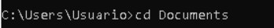

Creamos una carpeta con tu nombre

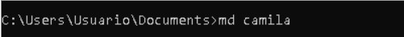

Nos metemos en la carpeta con tu nombre

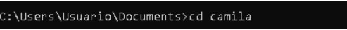

Creamos la carpeta del proyecto 

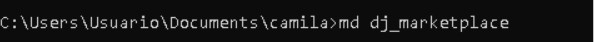

Nos metemos en la carpeta

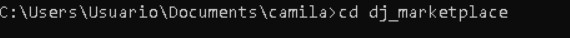

Inserta el código python -m venv venv

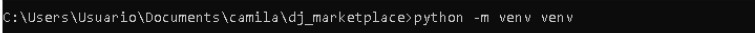

Activamos el ambiente virtual

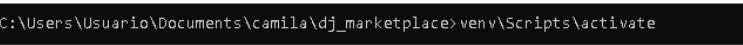

Instalamos Django y Pillow

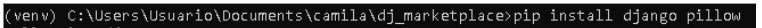

Verificamos con pip list

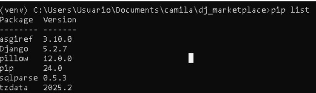

Nos metemos en la carpeta de marketplace_main donde esta todo el codigo

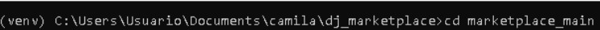

Le damos en correr el servidor


Copia este link

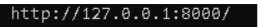

Lo pegas en google chrome o en tu navegador de preferencia

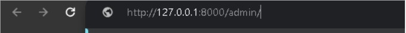

Nos dará esta interfaz

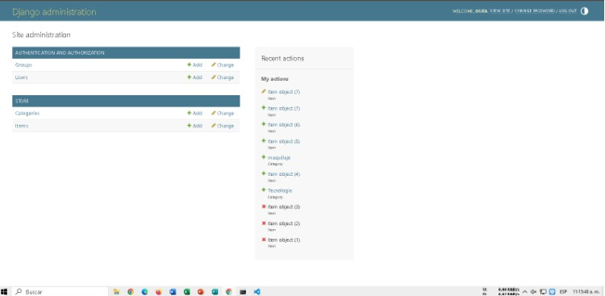

Aquí es la sección de crear categorías y items

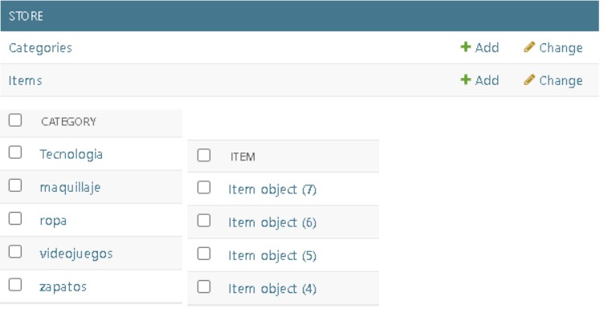

Creamos nuevo objeto

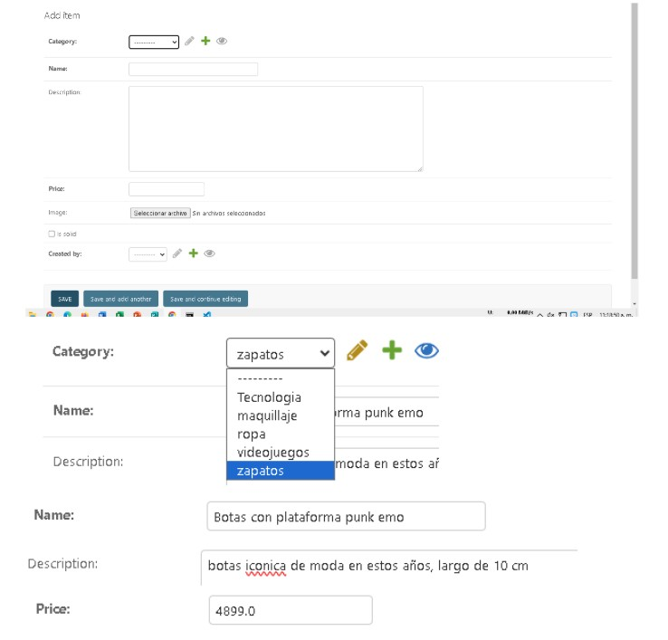
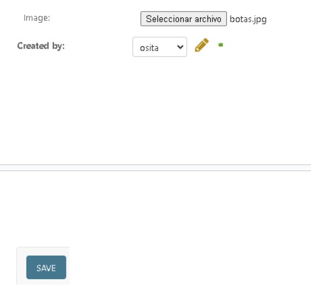

Quitamos el /admin/ y este es el resultado de la ejecución:

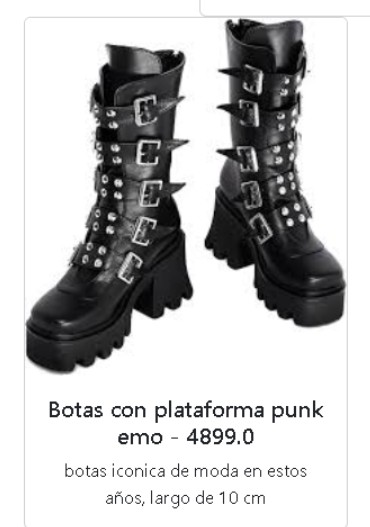

Y esto sería el resultado 

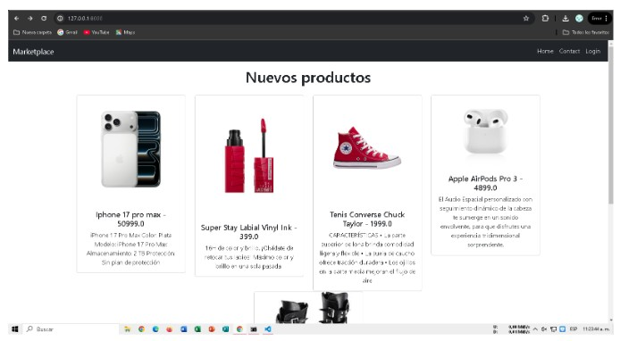

Tenemos una sección llamada “contact” donde le das click y te sale otra interfaz para contactarte pero aun no es funcional

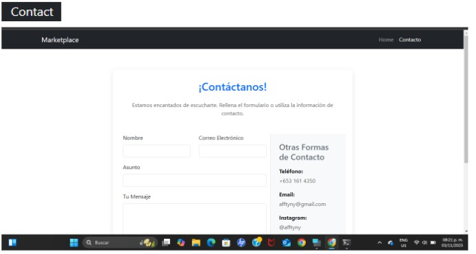

---

# Actualizaciones del proyecto marketplace _main
# (descripción)

## - Forms.py

En este archivo se definen los formularios que utilizará la aplicación para recibir datos del usuario. Se encarga de validar que los datos ingresados sean correctos antes de enviarlos a la vista.
### LoginForm:
- Sirve para que el usuario inicie sesión.
- Contiene campos como:
- Usuario o correo
- Contraseña

### SignupForm:
Se usa para el registro de nuevos usuarios. Valida que las contraseñas coincidan y que el usuario no esté repetido.
Incluye campos como:
- Nombre de usuario
- Correo
- Contraseña
- Confirmación de contraseña

### NewItemForm:
Permite agregar un nuevo producto o artículo al marketplace. Ayuda a que el usuario ingrese información correctamente antes de guardarla en la base de datos.
Incluye datos como:
- Nombre del producto
- Descripción
- Precio
- Imagen

## - Views.py

### login():
Maneja el inicio de sesión:
- Recibe los datos del formulario
- Verifica si el usuario existe
- Inicia la sesión si los datos son correctos
- Si no, muestra error

### logout_user():
Cierra la sesión del usuario:
- Elimina la sesión activa
- Redirige al usuario a otra página (normalmente inicio o login)

### detail():
Muestra el detalle de un producto:
- Obtiene la información del artículo desde la base de datos
- Envía esos datos a la plantilla para mostrarlos al usuario

### add_item():
Permite agregar un nuevo artículo:
- Muestra el formulario NewItemForm
- Valida la información
- Guarda el artículo en la base de datos
- Redirige al usuario después de guardar

### - @login_required
Este decorador sirve para proteger las vistas. Indica que solo los usuarios que hayan iniciado sesión pueden acceder a esa función.

## - Urls.py

En este archivo se definen las rutas del proyecto, es decir, qué función se ejecuta cuando el usuario entra a una URL específica. Este archivo conecta el frontend (URLs) con las vistas (views).
Contiene:
- login(): Ruta para iniciar sesión
- logout_user(): Ruta para cerrar sesión
- detail(): Ruta para ver detalles de un producto
- add_item(): Ruta para agregar un producto

## - store/templates

Aquí se encuentran las plantillas HTML que se muestran en el navegador.
### item.html:
Muestra la información detallada de un producto:
- Nombre
- Precio
- Descripción
- Imagen

### login.html
Contiene el formulario de inicio de sesión. Permite al usuario ingresar su usuario y contraseña.

### signup.html
Contiene el formulario de registro para crear una nueva cuenta.

### navigation.html
Es la barra de navegación del sitio:
- Enlaces a inicio
- Login
- Registro
- Agregar producto

### form.html
Es una plantilla genérica para mostrar formularios.
Se reutiliza para distintos formularios como:
- Login
- Registro
- Agregar producto
- Evita repetir el mismo código en varias páginas.

---

# Código

## - Forms.py (LoginForm, SignupForm, NewItemForm)

```
from django import forms
from django.contrib.auth.forms import UserCreationForm, AuthenticationForm
from django.contrib.auth.models import User


from .models import Item


class LoginForm(AuthenticationForm):
    username = forms.CharField(widget=forms.TextInput(
        attrs={
            'placeholder': 'Tu usuario',
            'class': 'form-control'
        }
    ))


    password = forms.CharField(widget=forms.PasswordInput(
        attrs={
            'placeholder': 'password',
            'class': 'form-control'
        }
    ))


class SignupForm(UserCreationForm):
    class Meta:
        model = User
        fields = ('username', 'email', 'password1', 'password2')


    username = forms.CharField(widget=forms.TextInput(
        attrs={
            'placeholder': 'Tu Usuario',
            'class': 'form-control'
        }
    ))


    email = forms.CharField(widget=forms.EmailInput(
        attrs={
            'placeholder': 'Tu Email',
            'class': 'form-control'
        }
    ))


    password1 = forms.CharField(widget=forms.PasswordInput(
        attrs={
            'placeholder': 'Password',
            'class': 'form-control'
        }
    ))


    password2 = forms.CharField(widget=forms.PasswordInput(
        attrs={
            'placeholder': 'Repite Password',
            'class': 'form-control'
        }
    ))


class NewItemForm(forms.ModelForm):
    class Meta:
        model = Item
        fields = ('category', 'name', 'description', 'price', 'image',)


        widgets = {
            'category': forms.Select(attrs={
                'class': 'form-select'
            }),
            'name': forms.TextInput(attrs={
                'class': 'form-control'
            }),
            'description': forms.Textarea(attrs={
                'class': 'form-control',
                'style': 'height: 100px'
            }),
            'price': forms.TextInput(attrs={
                'class': 'form-control',
            }),
            'price': forms.TextInput(attrs={
                'class': 'form-control',
            }),
            'image': forms.FileInput(attrs={
                'class': 'form-control',
            }),
        }
```

## - Views.py (login(), logout_user(), detail(), add_item())

```
from django.shortcuts import render, get_object_or_404, redirect
from django.contrib.auth.decorators import login_required
from django.contrib.auth import logout


from .models import Item, Category


from .forms import SignupForm, NewItemForm


# Create your views here.
def home(request):
    items = Item.objects.filter(is_solid=False)
    categories = Category.objects.all()


    context = {
        'items': items,
        'categories': categories
    }
    return render(request, 'store/home.html', context)


def contact(request):
    context = {
        'msg': 'Quieres otros productos contactame!'
    }


    return render(request, 'store/contact.html', context)


def detail(request, pk):
    item = get_object_or_404(Item, pk=pk)
    related_items = Item.objects.filter(category=item.category, is_solid=False).exclude(pk=pk)[0:3]
    context={
        'item': item,
        'related_items': related_items
    }


    return render(request, 'store/item.html', context)


def register(request):
    if request.method == 'POST':
        form = SignupForm(request.POST)


        if form.is_valid():
            form.save()
            return redirect('login')
    else:
        form = SignupForm()


    context = {
        'form': form
    }


    return render(request, 'store/signup.html', context)


def logout_user(request):
    logout(request)


    return redirect('home')


@login_required
def add_item(request):
    if request.method == 'POST':
        form = NewItemForm(request.POST, request.FILES)


        if form.is_valid():
            item = form.save(commit=False)
            item.created_by = request.user
            item.save()


            return redirect('detail', pk=item.id)
    else:
        form = NewItemForm()
        context = {
            'form': form,
            'title': 'New Item'
        }


    return render(request, 'store/form.html', context)
```

## - Decorador @login_required

```
@login_required
def add_item(request):
    if request.method == 'POST':
        form = NewItemForm(request.POST, request.FILES)


        if form.is_valid():
            item = form.save(commit=False)
            item.created_by = request.user
            item.save()


            return redirect('detail', pk=item.id)
    else:
        form = NewItemForm()
        context = {
            'form': form,
            'title': 'New Item'
        }
```

## - Urls.py (Las rutas a cada acción nueva en views)

```
from django.urls import path
from django.contrib.auth import views as auth_views
from .views import contact, detail, register, logout_user, add_item


from .forms import LoginForm


urlpatterns = [
    path('contact/', contact, name='contact'),
    path('register/', register, name='register'),
    path('login/', auth_views.LoginView.as_view(template_name='store/login.html', authentication_form=LoginForm), name='login'),
    path('logout/', logout_user, name='logout'),
    path('add_item/', add_item, name='add_item'),
    path('detail/<int:pk>/', detail, name='detail'),
]
```

## - store/templates (item.html, login.html, signup.html, navigation.html, form.html)

### item.html

```

{{item.name}}| 



<div class="container mt-4 mb-4">
    <div class="row">
        <div class="col-4">
            
        </div>
        <div class="col-8 p-4 rounded bg-light">
            <h1 class="mb-4 text-center">
                {{ item.name }}
            </h1>
            <hr>
            <h4><strong>Precio ${{item.price}}</strong></h4>
            <h4><strong>Vendedor {{item.created_by.username}}</strong></h4>


            
            <p>{{item.description}}</p>
            


            <a href="" class="btn btn-dark">Contacta a el vendedor</a>


        </div>
    </div>
</div>

```

### login.html

```



Login| 





<div class="row p-4 d-flex justify-content-center align-items-center">
    <div class="col-6 bg-light p-4">
        <h4 class="mb-6 text-center">Registro</h4>
        <hr>
        <form action="." method="POST">
            
            <div class="form-floating mb-3">
                <h6>Username:</h6>
                {{form.username}}
            </div>
            <div class="form-floating mb-3">
                <h6>Password:</h6>
                {{form.password}}
            </div>


            
            <div class="mb-4 p-6 bg-danger text-white rounded">
                
                field.errors
                
                {{ form.non_field_errors }}
            </div>
            
            <div class="d-flex justify-content-center align-items-center">
                <button class="btn btn-primary mb-6">Login</button>
            </div>
            <div class="d-flex justify-content-center align-items-center">
                <a href="">¿No tienes cuenta? ¡Registrate aquí!</a>
            </div>
        </form>
    </div>
</div>



```

### signup.html

```



Registro| 



<div class="row p-4 d-flex justify-content-center align-items-center">
    <div class="col-6 bg-light p-4">
        <h4 class="mb-6 text-center">Registro</h4>
        <hr>
        <form action="." method="POST">
            
            <div class="form-floating mb-3">
                <h6>Username:</h6>
                {{form.username}}
            </div>
            <div class="form-floating mb-3">
                <h6>Email:</h6>
                {{form.email}}
            </div>
            <div class="form-floating mb-3">
                <h6>Password:</h6>
                {{form.password1}}
            </div>
            <div class="form-floating mb-3">
                <h6>Repite Password:</h6>
                {{form.password2}}
            </div>


            
                <div class="mb-4 p-6 bg-danger rounded">
                    
                        <h5 class="text-white">
                            {{field.errors}}
                        </h5>
                       
                    
                    {{ form.non_field_errors }}
                </div>
            


            <div class="d-flex justify-content-center align-items-center">
                <button class="btn btn-primary mb-6">Register</button>
            </div>
            <div class="d-flex justify-content-center align-items-center">
                <a href="">¿Ya tienes cuenta? Accesa aqui!</a>
            </div>
        </form>
    </div>
</div>

```

### navigation.html

```
<nav class="navbar navbar-expand-lg bg-dark" data-bs-theme="dark">
    <div class="container-fluid">
        <a href="" class="navbar-brand">Marketplace</a>
        <button class="navbar-toggler" type="button" data-bs-toggle="collapse" data-bs-target="#navbarNav" aria-control="navBarNav" aria-expanded="false" aria-label="Toggle Navigation">
            <span class="navbar-toggler-icon"></span>
        </button>
        <div class="collapse navbar-collapse" id="navbarNav">
            <ul class="navbar-nav ms-auto">
                <li class="nav-item">
                    <a href="" class="nav-link active">
                        Home
                    </a>
                </li>
                <li class="nav-item">
                    <a href="" class="nav-link active">
                        Contact
                    </a>
                </li>
               
                
                    <!-- nuevo link -->
                    <li class="nav-item">
                        <a class="nav-link" href="">Add Item</a>
                    </li>
                    <li class="nav-item">
                        <a href="" class="nav-link active">
                            Logout
                        </a>
                    </li>
                
                    <li class="nav-item">
                        <a href="" class="nav-link active">
                            Login
                        </a>
                    </li>
                    <li class="nav-item">
                        <a href="" class="nav-link active">
                            Register
                        </a>
                    </li>
                
            </ul>
        </div>
    </div>
</nav>
```

### form.html

```



 {{ title }} 



    <h4 class="mb-4 mt-4">{{ title }}</h4>
    <hr>
    <form action="." method="POST" enctype="multipart/form-data">
        
        <div>
       
            {{ form.as_p }}
        </div>


        
            <div class="mb-4 p-6 bg-danger">
                
                    {{ field.errors }}
                


                {{ form.non_field_errors }}
            </div>
        


        <button class="btn btn-primary mb-6">Register</button>
    </form>

```
---

# Ejecución del proyecto actualizado:


Nos metemos a la carpeta de Docs.

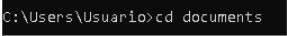

Creamos una carpeta con tu nombre e ingresamos a ella.

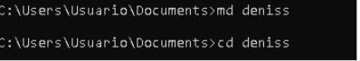

Creamos la carpeta del proyecto e ingresamos a la carpeta.

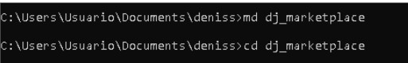

Inserta el código python -m venv venv

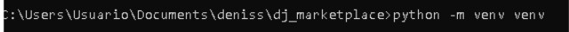

Activamos el ambiente virtual

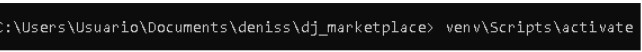

Instalamos Django y Pillow

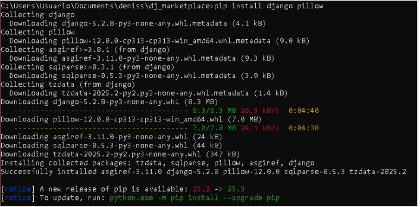

Insertamos el código git clone e insertamos la url de nuestro proyecto previamente guardado en github.

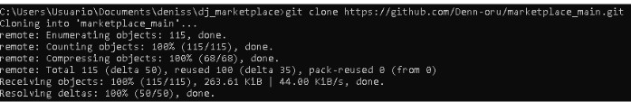

Nos metemos a la carpeta marketplace _main

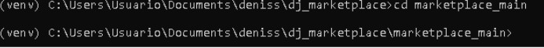

Insertamos el código manage.py

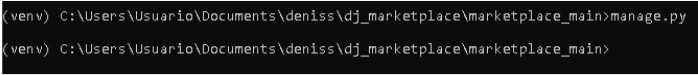

Le damos en correr el servidor y pegamos el link en el buscador de google.

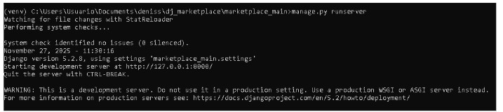

Y ya en la página nos registramos haciendo clic en la sección Register.

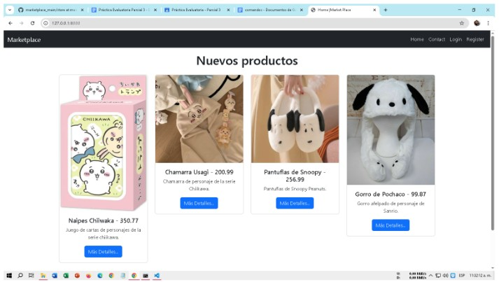

Nos llevará a la sección de registro donde insertamos los datos que nos pide para crear una cuenta en la página.

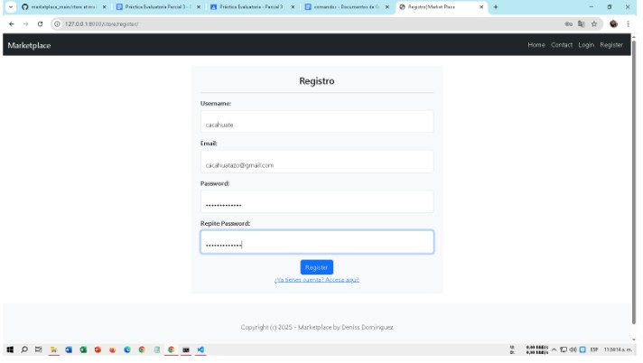

Una vez registrados ya podemos agregar items desde nuestra página.

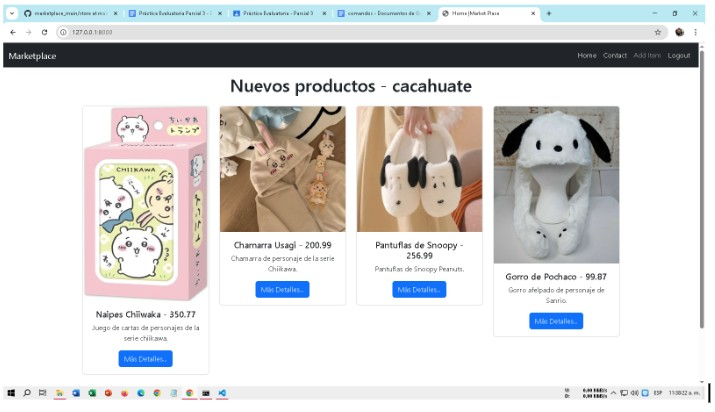

Nos llevará a una pantalla donde ingresamos todos los datos de nuestro producto para subirlo a la página.

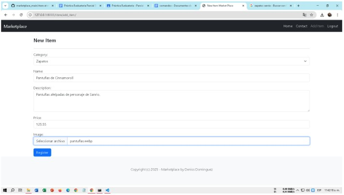

Cuando completamos el registro nos llevará automáticamente a la página de detalles del producto registrado.

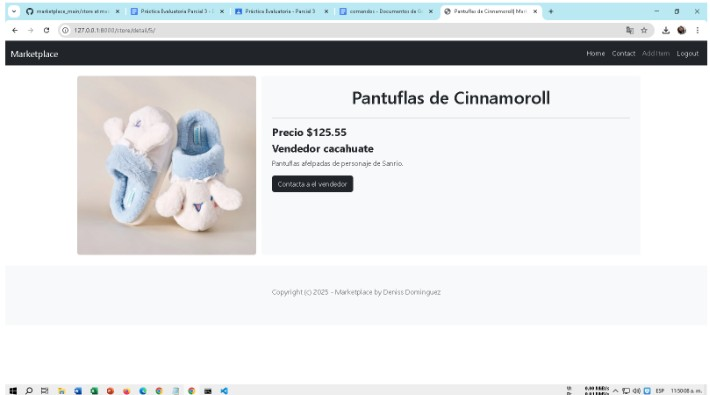

Y ya estará nuestro producto en la página principal.

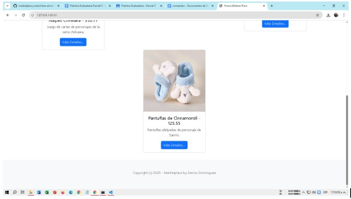
